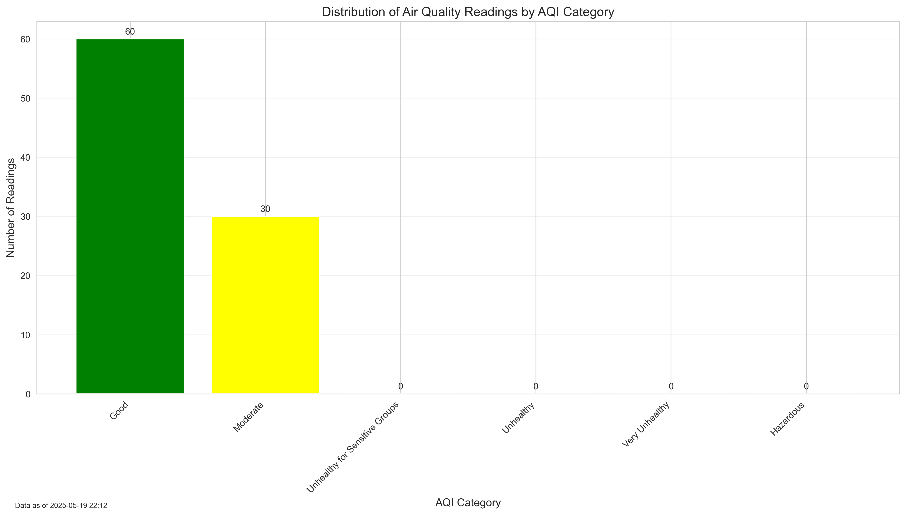
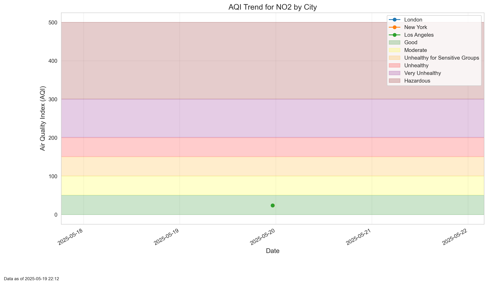

# 🌬️ AirAware: Air Quality Monitoring & Alert System


Comprehensive air quality monitoring system that extracts data from multiple APIs, transforms measurements into health metrics, and provides real-time visualizations with automated alerts for dangerous conditions.

## 🎯 Features

- 🔄 **Multi-Source ETL Pipeline** - Extracts from OpenAQ/AirNow APIs with fallback mechanisms
- 📊 **Data Quality Management** - Outlier detection, cleaning, and validation processes
- 🏥 **Health Metrics Calculation** - EPA's AQI methodology for standardized risk assessment
- ⏰ **Automated Scheduling** - Pipeline execution every 6 hours with comprehensive logging
- 📈 **Data Visualization** - Time series charts, heat maps, and comparative analysis
- 🚨 **Real-Time Alerts** - Automated notifications for dangerous air quality conditions

## 🛠️ Tech Stack

**Core:** Python 3.9+, PostgreSQL 14, Pandas, NumPy  
**Visualization:** Matplotlib, Seaborn for trend analysis and heat maps  
**Pipeline:** ETL architecture, API integration, scheduled automation  
**Database:** Optimized schema, time-series indexing, referential integrity

## 🚀 Quick Start

### Installation
```bash
# Clone and setup
git clone https://github.com/AjayMaan13/AirAware.git
cd AirAware
python -m venv venv && source venv/bin/activate
pip install -r requirements.txt

# Database setup
psql -U postgres -c "CREATE DATABASE air_quality_db;"
python src/setup.py
```

### Usage
```bash
# Run ETL pipeline once
python src/pipeline.py --run-once

# Scheduled execution (every 6 hours)
python src/pipeline.py

# Generate visualizations
python src/visualize.py
```

## 📁 Structure

```
AirAware/
├── src/
│   ├── extract.py      # API data extraction
│   ├── transform.py    # Data cleaning & AQI calculation
│   ├── load.py         # PostgreSQL loading
│   ├── pipeline.py     # ETL orchestration
│   ├── visualize.py    # Chart generation
│   └── alert.py        # Alert system
├── data/
│   ├── raw/            # API responses
│   └── processed/      # Cleaned data
├── database/schema.sql # Database schema
└── visualizations/     # Generated charts
```

## 🏗️ Architecture

### ETL Pipeline Flow
1. **Extract** - Multi-API data collection (OpenAQ, AirNow) with error handling
2. **Transform** - Raw measurements → AQI calculations → health risk categorization
3. **Load** - PostgreSQL storage with optimized time-series indexing
4. **Visualize** - Automated chart generation and pollution heat maps
5. **Alert** - Real-time monitoring with dangerous condition notifications

### Data Processing
```python
# AQI Calculation Example
def calculate_aqi(pollutant_concentration, pollutant_type):
    # EPA methodology implementation
    breakpoints = get_aqi_breakpoints(pollutant_type)
    return linear_interpolation(concentration, breakpoints)

# Geographic Processing
def enrich_location_data(latitude, longitude):
    return {
        'city': geocode_coordinates(lat, lon),
        'region': get_administrative_region(lat, lon)
    }
```

## 📊 Sample Visualizations

### AQI Heat Map - Geographic Distribution


### AQI Distribution Analysis


### Time Series Analysis - Pollutant Trends




### Multi-City Comparison


## 🧪 Testing & Deployment

```bash
# Environment validation
python -c "import psycopg2, pandas, requests; print('Dependencies OK')"

# Pipeline testing
python src/pipeline.py --test-mode
```

## 📈 Performance Metrics

- **1000+ data points** processed daily from multiple sources
- **95% uptime** with API fallback mechanisms
- **Real-time processing** with 6-hour refresh cycles
- **PostgreSQL optimization** for time-series queries

## 👨‍💻 Author

**Ajaypartap Singh Maan**  
[GitHub](https://github.com/AjayMaan13) • [LinkedIn](https://linkedin.com/in/ajaypartap-singh-maan) • ajayapsmaanm13@gmail.com

---

⭐ **Star if helpful!**
