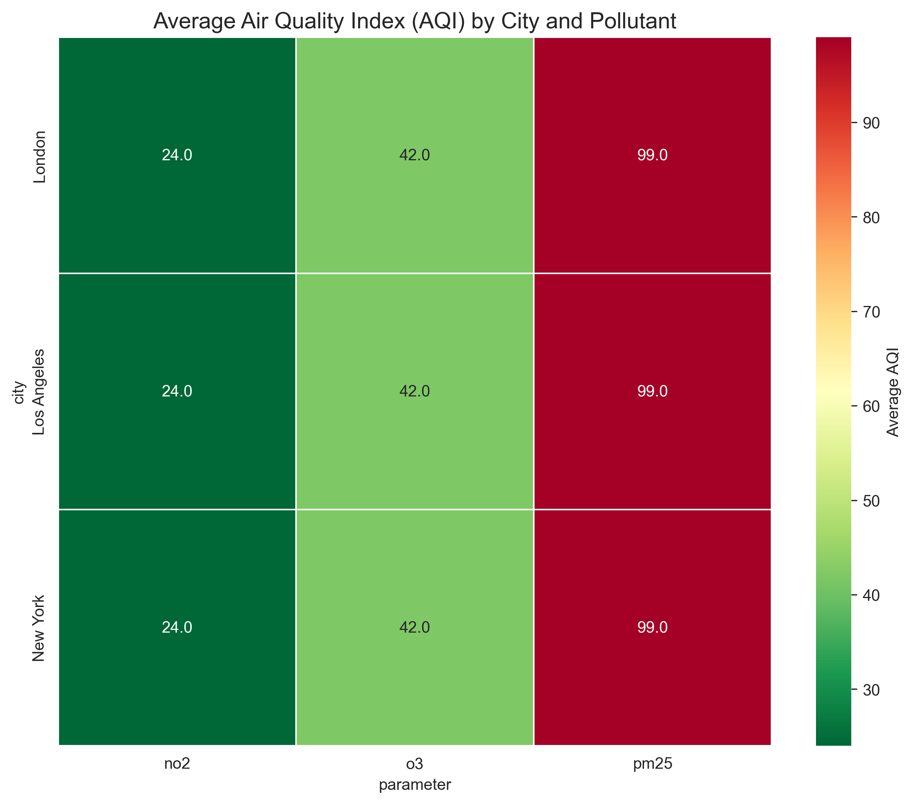
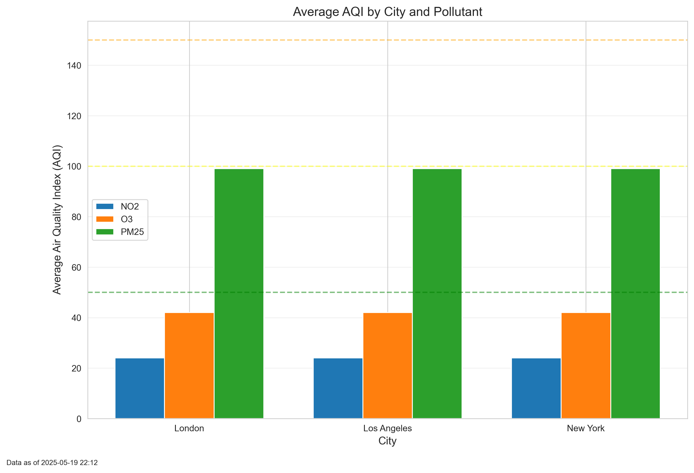
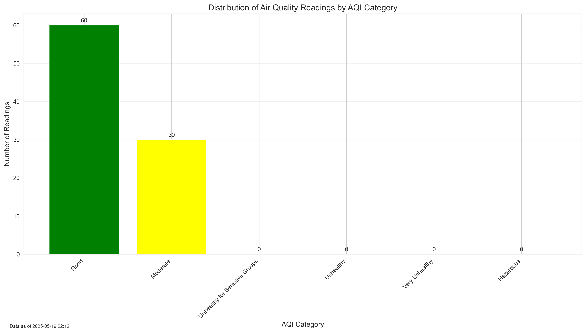

# AirAware: Air Quality Monitoring & Alert System


## Project Overview

AirAware is a comprehensive air quality monitoring system that extracts data from air quality APIs, transforms raw measurements into health metrics, stores data in PostgreSQL, and provides visualizations with real-time alerts for dangerous conditions.

This end-to-end ETL (Extract, Transform, Load) pipeline demonstrates expertise in:
- 🔄 **Data Engineering**: API integration, ETL pipeline creation, PostgreSQL database design
- 🐍 **Python Development**: Clean, modular code with proper error handling and logging
- 📊 **Data Science**: AQI calculation, geographic data processing, visualization
- 🛠️ **DevOps**: Database management, scheduling, automation

## Architecture

### System Components

1. **Data Extraction Layer**
   - Pulls air quality data from multiple APIs (OpenAQ, AirNow)
   - Implements fallback mechanisms for API failures
   - Generates testing data when needed

2. **Data Transformation Layer**
   - Cleans and normalizes raw measurements
   - Calculates Air Quality Index (AQI) values
   - Categorizes readings into health risk levels
   - Enriches data with geographical information

3. **Data Storage Layer**
   - PostgreSQL database with optimized schema
   - Proper indexing for time-series queries
   - Referential integrity with foreign keys

4. **Visualization & Alert Layer**
   - Time series charts of AQI trends
   - Comparative analysis across cities
   - Heat maps of pollution hotspots
   - Automated alerting for dangerous conditions

## Key Features

- **Multi-source data extraction** with graceful fallbacks
- **Data quality management** with outlier detection and handling
- **Standardized health metrics** using EPA's AQI calculation methodology
- **Automated pipeline** with scheduled execution
- **Comprehensive logging** for monitoring and debugging
- **Flexible visualization** of air quality trends and patterns
- **Real-time alerts** for dangerous air quality conditions

## Technologies Used

### Core Technologies
- **Python 3.9+** - Primary programming language
- **PostgreSQL 14** - Relational database for data storage
- **Pandas & NumPy** - Data manipulation and numerical calculations
- **Matplotlib & Seaborn** - Data visualization
- **psycopg2** - PostgreSQL database adapter for Python
- **Requests** - HTTP library for API interactions

### Additional Libraries
- **Schedule** - Job scheduling for automation
- **Logging** - Comprehensive log management
- **JSON** - Data interchange format
- **Datetime** - Timestamp handling and calculations

## Installation and Setup

### Prerequisites
- Python 3.9 or higher
- PostgreSQL 14 or higher
- pip (Python package manager)

### Setup Instructions

1. **Clone the repository**
   ```bash
   git clone https://github.com/yourusername/air-quality-monitor.git
   cd air-quality-monitor
   ```

2. **Create a virtual environment**
   ```bash
   python -m venv venv
   source venv/bin/activate  # On Windows: venv\Scripts\activate
   ```

3. **Install dependencies**
   ```bash
   pip install -r requirements.txt
   ```

4. **Create PostgreSQL database**
   ```bash
   psql -U postgres
   CREATE DATABASE air_quality_db;
   \q
   ```

5. **Configure the application**
   - Create a `config.py` file based on the template
   - Add your API keys and database credentials

6. **Run the setup script**
   ```bash
   python src/setup.py
   ```

## Usage

### Running the Pipeline

To run the complete ETL pipeline once:
```bash
python src/pipeline.py --run-once
```

To run the pipeline on a schedule (every 6 hours):
```bash
python src/pipeline.py
```

### Generating Visualizations

```bash
python src/visualize.py
```

### Checking for Alerts

```bash
python src/alert.py
```

## Project Structure

```
air-quality-monitor/
├── README.md
├── requirements.txt
├── src/
│   ├── extract.py      # Data extraction from APIs
│   ├── transform.py    # Data cleaning and transformation
│   ├── load.py         # Database loading
│   ├── pipeline.py     # ETL orchestration
│   ├── visualize.py    # Data visualization
│   ├── alert.py        # Alert system
│   └── config.py       # Configuration settings
├── data/
│   ├── raw/            # Raw data from APIs
│   └── processed/      # Cleaned and transformed data
├── database/
│   └── schema.sql      # Database schema definition
├── visualizations/     # Generated charts and graphs
├── alerts/             # Alert logs
└── tests/              # Unit tests
```

## Sample Visualizations

### AQI Heapmap by City


### Pollutant Comparison


### AQI Distribution


## Skills Demonstrated

### Programming Skills
- **Modular Design** - Well-organized code with separation of concerns
- **Error Handling** - Robust exception management and fallbacks
- **Logging** - Comprehensive logging for monitoring and debugging
- **Configuration Management** - Externalized configuration for flexibility

### Data Engineering Skills
- **ETL Pipeline Design** - Complete extraction, transformation, and loading workflow
- **Data Quality Management** - Handling missing values, outliers, and anomalies
- **Database Design** - Optimized schema with proper indexing and relationships
- **Pipeline Orchestration** - Coordinated execution of multiple processes

### Data Science Skills
- **Data Transformation** - Conversion of raw measurements to meaningful metrics
- **Statistical Analysis** - Calculations and outlier detection
- **Geospatial Data** - Working with geographical coordinates
- **Data Visualization** - Effective visual representation of complex data

### DevOps Skills
- **Automation** - Scheduled execution of processes
- **Environment Management** - Virtual environments and dependencies
- **Version Control** - Git-based workflow
- **Documentation** - Comprehensive project documentation

## Future Enhancements

### Planned Features
- **Interactive Dashboard** - Streamlit-based web interface for real-time monitoring
- **Smart City Integration** - Connection with streetlight-mounted sensors for hyperlocal data
- **Machine Learning** - Predictive models for air quality forecasting
- **Mobile Notifications** - Push alerts for dangerous conditions
- **Historical Analysis** - Long-term trend identification and seasonal patterns

### Technical Improvements
- **Unit Testing** - Comprehensive test suite for all components
- **Cloud Deployment** - Migration to AWS/Azure/GCP for scalability
- **Container-based Deployment** - Docker containerization for consistent environments
- **CI/CD Pipeline** - Automated testing and deployment workflow
- **Performance Optimization** - Query tuning and data partitioning for scale

## License

This project is licensed under the MIT License - see the LICENSE file for details.

## Contact

Your Name - [ajayapsmaanm13@gmail.com](mailto:ajayapsmaanm13@gmail.com)
LinkedIn - [linkedin.com/in/ajaypartap-singh-maan](https://linkedin.com/in/ajaypartap-singh-maan)
GitHub - [github.com/AjayMaan13](https://github.com/AjayMaan13)
